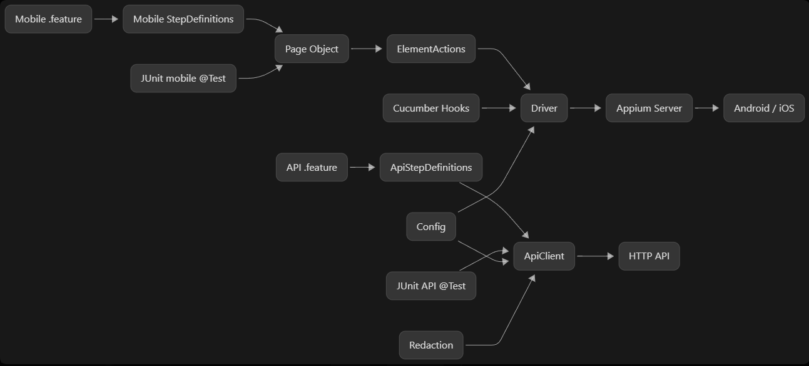

## Appium Mobile Automation Cheat Sheet


# Appium cheat sheet

Sık kullanılan komutlar ve locator örnekleri. Bu notlar önceden `config.properties` içindeydi;
ayar dosyası ayar tutsun diye buraya taşındı.

## Komutlar (PowerShell)

| Amaç | Komut |
| --- | --- |
| Emulator listesi | `emulator -list-avds` |
| Emulator başlat | `emulator -avd Pixel8_API35` |
| Bağlı cihazlar | `adb devices -l` |
| Appium server | `appium.cmd` |
| Appium + Inspector plugin | `appium.cmd --use-plugins=inspector` |
| Server ayakta mı | `Invoke-RestMethod http://127.0.0.1:4723/status` |
| Ekrandaki package/activity | `adb shell dumpsys window \| Select-String mCurrentFocus` |
| 4723 portunu kullanan süreç | `Get-Process -Id (Get-NetTCPConnection -LocalPort 4723 -State Listen).OwningProcess` |
| 4723 portunu kapat | `Get-NetTCPConnection -LocalPort 4723 -State Listen \| Select-Object -ExpandProperty OwningProcess -Unique \| ForEach-Object { Stop-Process -Id $_ -Force }` |

Inspector web arayüzü: <http://127.0.0.1:4723/inspector> · Remote Host `127.0.0.1`, Port `4723`,
Path `/`

## Capability JSON karşılığı

`config.properties` içindeki anahtarlar Appium'a şu capability'ler olarak gider
(`core/Driver.java` kurar; `platformName` ve `automationName` platforma göre sabittir):

```json
{
  "platformName": "Android",
  "appium:automationName": "UiAutomator2",
  "appium:udid": "emulator-5554",
  "appium:appPackage": "io.appium.android.apis",
  "appium:appActivity": ".ApiDemos",
  "appium:noReset": true
}
```

## Locator öncelik sırası

| # | Strateji | Ne zaman |
| --- | --- | --- |
| 1 | `AppiumBy.accessibilityId()` → content-desc | İlk tercih |
| 2 | `AppiumBy.id()` → resource-id | id kadar iyi |
| 3 | `AppiumBy.androidUIAutomator()` → text/özellik | Kesinlikle öğren |
| 4 | `AppiumBy.className()` | Tek başına pek kullanma |
| 5 | `AppiumBy.xpath()` | Son çare |

## UiAutomator selector örnekleri

```java
AppiumBy.androidUIAutomator("new UiSelector().text(\"Alarm\")");
AppiumBy.androidUIAutomator("new UiSelector().textContains(\"Alarm\")");
AppiumBy.androidUIAutomator("new UiSelector().textStartsWith(\"Al\")");
AppiumBy.androidUIAutomator("new UiSelector().textMatches(\"(?i).*alarm.*\")"); //(text ignorecase regex) (?i)
AppiumBy.androidUIAutomator("new UiSelector().description(\"Alarm\")"); //(text content-desc)
AppiumBy.androidUIAutomator("new UiSelector().descriptionContains(\"Alarm\")"); //(text content-desc contains)
AppiumBy.androidUIAutomator("new UiSelector().className(\"android.widget.Button\").clickable(true)");
AppiumBy.androidUIAutomator("new UiSelector().checkable(true).checked(true)");

// Iç içe kapsama: aynı id birden fazla yerde geçiyorsa
AppiumBy.androidUIAutomator(
        "new UiSelector().resourceId(\"io.appium.android.apis:id/spinner2\")"
                + ".childSelector(new UiSelector().resourceId(\"android:id/text1\"))");
```

## XPath örnekleri (son çare)

```java
AppiumBy.xpath("//*[@text='Alarm']");
AppiumBy.xpath("//*[contains(@text,'Alarm')]");
AppiumBy.xpath("//*[@text='Premium Paket']/parent::android.view.ViewGroup//android.widget.Button[@text='Seç']");
AppiumBy.xpath("//android.widget.Toast[@text='Monitored switch is on']");
```

## Bu projede nereye yazılır

Sabit locator'lar ait oldukları ekranın Page sınıfında, `mobile/pages/*Page.java` içinde
`private static final By` olarak durur — ayrı bir `locators` paketi yoktur. Değeri çalışma anında
gelen locator'lar (`byText`, `toast`) `mobile/actions/ElementActions` içindeki static üreticilerdir.

Kural: locator'ın sahibi Page'dir; `click`/`wait`/`scroll` gibi teknik dokunuşlar
`ElementActions` içinde toplanır; Step Definition katmanında ne locator ne driver bulunur.

## Allure terminal komutları

| Komut                                             | Amaç                      |
|---------------------------------------------------|---------------------------|
| `.\mvnw.cmd allure:report `                       | `Allure report build`     |
| `Start-Process .\target\allure-report\index.html` | `Allure report open html` |
